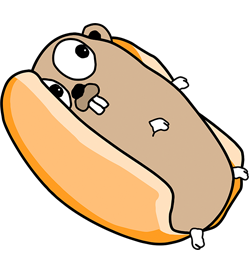

[](https://vshymanskyy.github.io/StandWithUkraine)
[](https://github.com/cucumber/godog/actions?query=branch%main+workflow%3Atest)
[](https://pkg.go.dev/github.com/cucumber/godog)
[](https://codecov.io/gh/cucumber/godog)
[](https://oselvar.com/github/cucumber/oselvar-github-metrics/main/cucumber/godog)
[](https://oselvar.com/github/cucumber/oselvar-github-metrics/main/cucumber/godog)

# Godog

<p align="center"></p>

**The API is likely to change a few times before we reach 1.0.0**

Please read the full README, you may find it very useful. And do not forget to peek into the [Release Notes](https://github.com/cucumber/godog/blob/master/release-notes) and the [CHANGELOG](https://github.com/cucumber/godog/blob/master/CHANGELOG.md) from time to time.

Package godog is the official Cucumber BDD framework for Golang, it merges specification and test documentation into one cohesive whole, using Gherkin formatted scenarios in the format of Given, When, Then.

The project was inspired by [behat][behat] and [cucumber][cucumber].

## Why Godog/Cucumber

### A single source of truth

Godog merges specification and test documentation into one cohesive whole.

### Living documentation

Because they're automatically tested by Godog, your specifications are
always bang up-to-date.

### Focus on the customer

Business and IT don't always understand each other. Godog's executable specifications encourage closer collaboration, helping teams keep the business goal in mind at all times.

### Less rework

When automated testing is this much fun, teams can easily protect themselves from costly regressions.

### Read more
- [Behaviour-Driven Development](https://cucumber.io/docs/bdd/)
- [Gherkin Reference](https://cucumber.io/docs/gherkin/reference/)

## Contributions

Godog is a community driven Open Source Project within the Cucumber organization. We [welcome contributions from everyone](https://cucumber.io/blog/open-source/tackling-structural-racism-(and-sexism)-in-open-so/), and we're ready to support you if you have the enthusiasm to contribute.

See the [contributing guide] for more detail on how to get started.

See the [releasing guide] for release flow details.

## Getting help

We have a [community Discord](https://cucumber.io/docs/community/get-in-touch/#discord) where you can chat with other users, developers, and BDD practitioners.

## Examples

You can find a few examples [here](/_examples).

**Note** that if you want to execute any of the examples and have the Git repository checked out in the `$GOPATH`, you need to use: `GO111MODULE=off`. [Issue](https://github.com/cucumber/godog/issues/344) for reference.

### Godogs

The following example can be [found here](/_examples/godogs).

#### Step 1 - Setup a go module

Create a new go module named **godogs** in your go workspace by running `mkdir godogs`

From now on, use **godogs** as your working directory by running `cd godogs`

Initiate the go module inside the **godogs** directory by running `go mod init godogs`

#### Step 2 - Create gherkin feature

Imagine we have a **godog cart** to serve godogs for lunch.

First of all, we describe our feature in plain text:

``` gherkin
Feature: eat godogs
  In order to be happy
  As a hungry gopher
  I need to be able to eat godogs

  Scenario: Eat 5 out of 12
    Given there are 12 godogs
    When I eat 5
    Then there should be 7 remaining
```

Run `vim features/godogs.feature` and add the text above into the vim editor and save the file.

#### Step 3 - Create godog step definitions

**NOTE:** Same as **go test**, godog respects package level isolation. All your step definitions should be in your tested package root directory. In this case: **godogs**.

Create and copy the step definitions below into a new file by running `vim godogs_test.go`:
``` go
package main

import "github.com/cucumber/godog"

func iEat(arg1 int) error {
        return godog.ErrPending
}

func thereAreGodogs(arg1 int) error {
        return godog.ErrPending
}

func thereShouldBeRemaining(arg1 int) error {
        return godog.ErrPending
}

func InitializeScenario(ctx *godog.ScenarioContext) {
        ctx.Step(`^there are (\d+) godogs$`, thereAreGodogs)
        ctx.Step(`^I eat (\d+)$`, iEat)
        ctx.Step(`^there should be (\d+) remaining$`, thereShouldBeRemaining)
}
```

Alternatively, you can also specify the keyword (Given, When, Then...) when creating the step definitions:
``` go
func InitializeScenario(ctx *godog.ScenarioContext) {
        ctx.Given(`^there are (\d+) godogs$`, thereAreGodogs)
        ctx.When(`^I eat (\d+)$`, iEat)
        ctx.Then(`^there should be (\d+) remaining$`, thereShouldBeRemaining)
}
```

Our module should now look like this:
```
godogs
- features
  - godogs.feature
- go.mod
- go.sum
- godogs_test.go
```

Run `go test` in the **godogs** directory to run the steps you have defined. You should now see that the scenario runs 
with a warning stating there are no tests to run. 
```
testing: warning: no tests to run
PASS
ok      godogs  0.225s
```

By adding some logic to these steps, you will be able to thoroughly test the feature you just defined.

#### Step 4 - Create the main program to test

Let's keep it simple by only requiring an amount of **godogs** for now.

Create and copy the code below into a new file by running `vim godogs.go`
```go
package main

// Godogs available to eat
var Godogs int

func main() { /* usual main func */ }
```

Our module should now look like this:
```
godogs
- features
  - godogs.feature
- go.mod
- go.sum
- godogs.go
- godogs_test.go
```

#### Step 5 - Add some logic to the step definitions

Now lets implement our step definitions to test our feature requirements.

Replace the contents of `godogs_test.go` with the code below by running `vim godogs_test.go`.

```go
package main

import (
  "context"
  "errors"
  "fmt"
  "testing"

  "github.com/cucumber/godog"
)

// godogsCtxKey is the key used to store the available godogs in the context.Context.
type godogsCtxKey struct{}

func thereAreGodogs(ctx context.Context, available int) (context.Context, error) {
  return context.WithValue(ctx, godogsCtxKey{}, available), nil
}

func iEat(ctx context.Context, num int) (context.Context, error) {
  available, ok := ctx.Value(godogsCtxKey{}).(int)
  if !ok {
    return ctx, errors.New("there are no godogs available")
  }

  if available < num {
    return ctx, fmt.Errorf("you cannot eat %d godogs, there are %d available", num, available)
  }

  available -= num

  return context.WithValue(ctx, godogsCtxKey{}, available), nil
}

func thereShouldBeRemaining(ctx context.Context, remaining int) error {
  available, ok := ctx.Value(godogsCtxKey{}).(int)
  if !ok {
    return errors.New("there are no godogs available")
  }

  if available != remaining {
    return fmt.Errorf("expected %d godogs to be remaining, but there is %d", remaining, available)
  }

  return nil
}

func TestFeatures(t *testing.T) {
  suite := godog.TestSuite{
    ScenarioInitializer: InitializeScenario,
    Options: &godog.Options{
      Format:   "pretty",
      Paths:    []string{"features"},
      TestingT: t, // Testing instance that will run subtests.
    },
  }

  if suite.Run() != 0 {
    t.Fatal("non-zero status returned, failed to run feature tests")
  }
}

func InitializeScenario(sc *godog.ScenarioContext) {
  sc.Step(`^there are (\d+) godogs$`, thereAreGodogs)
  sc.Step(`^I eat (\d+)$`, iEat)
  sc.Step(`^there should be (\d+) remaining$`, thereShouldBeRemaining)
}
```

In this example, we are using `context.Context` to pass the state between the steps. 
Every scenario starts with an empty context and then steps and hooks can add relevant information to it.
Instrumented context is chained through the steps and hooks and is safe to use when multiple scenarios are running concurrently.

When you run godog again with `go test -v godogs_test.go`, you should see a passing run:
```
=== RUN   TestFeatures
Feature: eat godogs
  In order to be happy
  As a hungry gopher
  I need to be able to eat godogs
=== RUN   TestFeatures/Eat_5_out_of_12

  Scenario: Eat 5 out of 12          # features/godogs.feature:6
    Given there are 12 godogs        # godog_test.go:15 -> command-line-arguments.thereAreGodogs
    When I eat 5                     # godog_test.go:19 -> command-line-arguments.iEat
    Then there should be 7 remaining # godog_test.go:34 -> command-line-arguments.thereShouldBeRemaining

1 scenarios (1 passed)
3 steps (3 passed)
279.917µs
--- PASS: TestFeatures (0.00s)
    --- PASS: TestFeatures/Eat_5_out_of_12 (0.00s)
PASS
ok      command-line-arguments  0.164s
```

You may hook to `ScenarioContext` **Before** event in order to reset or pre-seed the application state before each scenario. 
You may hook into more events, like `sc.StepContext()` **After** to print all state in case of an error. 
Or **BeforeSuite** to prepare a database.

By now, you should have figured out, how to use **godog**. Another piece of advice is to make steps orthogonal, small and simple to read for a user. 
Whether the user is a dumb website user or an API developer, who may understand a little more technical context - it should target that user.

When steps are orthogonal and small, you can combine them just like you do with Unix tools. Look how to simplify or remove ones, which can be composed.

`TestFeatures` acts as a regular Go test, so you can leverage your IDE facilities to run and debug it.

### Attachments

An example showing how to make attachments (aka embeddings) to the results is shown in [_examples/attachments](/_examples/attachments/)

## Code of Conduct

Everyone interacting in this codebase and issue tracker is expected to follow the Cucumber [code of conduct](https://github.com/cucumber/cucumber/blob/master/CODE_OF_CONDUCT.md).

## References and Tutorials

- [cucumber-html-reporter](https://github.com/gkushang/cucumber-html-reporter),
  may be used in order to generate **html** reports together with **cucumber** output formatter. See the [following docker image](https://github.com/myie/cucumber-html-reporter) for usage details.
- [how to use godog by semaphoreci](https://semaphoreci.com/community/tutorials/how-to-use-godog-for-behavior-driven-development-in-go)
- see [examples](https://github.com/cucumber/godog/tree/master/_examples)
- see extension [AssistDog](https://github.com/hellomd/assistdog),
  which may have useful **gherkin.DataTable** transformations or comparison methods for assertions.

## Documentation

See [pkg documentation][godoc] for general API details.
See **[Circle Config](/.circleci/config.yml)** for supported **go** versions.
See `godog -h` for general command options.

See implementation examples:

- [rest API server](/_examples/api)
- [rest API with Database](/_examples/db)
- [godogs](/_examples/godogs)

## FAQ

### Running Godog with go test

You may integrate running **godog** in your **go test** command. 

#### Subtests of *testing.T

You can run test suite using go [Subtests](https://pkg.go.dev/testing#hdr-Subtests_and_Sub_benchmarks).
In this case it is not necessary to have **godog** command installed. See the following example.

```go
package main_test

import (
	"testing"

	"github.com/cucumber/godog"
)

func TestFeatures(t *testing.T) {
  suite := godog.TestSuite{
    ScenarioInitializer: func(s *godog.ScenarioContext) {
      // Add step definitions here.
    },
    Options: &godog.Options{
      Format:   "pretty",
      Paths:    []string{"features"},
      TestingT: t, // Testing instance that will run subtests.
    },
  }

  if suite.Run() != 0 {
    t.Fatal("non-zero status returned, failed to run feature tests")
  }
}
```

Then you can run suite.
```
go test -test.v -test.run ^TestFeatures$
```

Or a particular scenario.
```
go test -test.v -test.run ^TestFeatures$/^my_scenario$
```

#### TestMain

You can run test suite using go [TestMain](https://golang.org/pkg/testing/#hdr-Main) func available since **go 1.4**. 
In this case it is not necessary to have **godog** command installed. See the following examples.

The following example binds **godog** flags with specified prefix `godog` in order to prevent flag collisions.

```go
package main

import (
	"os"
	"testing"

	"github.com/cucumber/godog"
	"github.com/cucumber/godog/colors"
	"github.com/spf13/pflag" // godog v0.11.0 and later
)

var opts = godog.Options{
	Output: colors.Colored(os.Stdout),
	Format: "progress", // can define default values
}

func init() {
	godog.BindFlags("godog.", pflag.CommandLine, &opts) // godog v0.10.0 and earlier
	godog.BindCommandLineFlags("godog.", &opts)        // godog v0.11.0 and later
}

func TestMain(m *testing.M) {
	pflag.Parse()
	opts.Paths = pflag.Args()

	status := godog.TestSuite{
		Name: "godogs",
		TestSuiteInitializer: InitializeTestSuite,
		ScenarioInitializer:  InitializeScenario,
		Options: &opts,
	}.Run()

	// Optional: Run `testing` package's logic besides godog.
	if st := m.Run(); st > status {
		status = st
	}

	os.Exit(status)
}
```

Then you may run tests with by specifying flags in order to filter features.

```
go test -v --godog.random --godog.tags=wip
go test -v --godog.format=pretty --godog.random -race -coverprofile=coverage.txt -covermode=atomic
```

The following example does not bind godog flags, instead manually configuring needed options.

```go
func TestMain(m *testing.M) {
	opts := godog.Options{
		Format:    "progress",
		Paths:     []string{"features"},
		Randomize: time.Now().UTC().UnixNano(), // randomize scenario execution order
	}

	status := godog.TestSuite{
		Name: "godogs",
		TestSuiteInitializer: InitializeTestSuite,
		ScenarioInitializer:  InitializeScenario,
		Options: &opts,
	}.Run()

	// Optional: Run `testing` package's logic besides godog.
	if st := m.Run(); st > status {
		status = st
	}

	os.Exit(status)
}
```

You can even go one step further and reuse **go test** flags, like **verbose** mode in order to switch godog **format**. See the following example:

```go
func TestMain(m *testing.M) {
	format := "progress"
	for _, arg := range os.Args[1:] {
		if arg == "-test.v=true" { // go test transforms -v option
			format = "pretty"
			break
		}
	}

	opts := godog.Options{
		Format: format,
		Paths:     []string{"features"},
	}

	status := godog.TestSuite{
		Name: "godogs",
		TestSuiteInitializer: InitializeTestSuite,
		ScenarioInitializer:  InitializeScenario,
		Options: &opts,
	}.Run()

	// Optional: Run `testing` package's logic besides godog.
	if st := m.Run(); st > status {
		status = st
	}

	os.Exit(status)
}
```

Now when running `go test -v` it will use **pretty** format.

### Tags

If you want to filter scenarios by tags, you can use the `-t=<expression>` or `--tags=<expression>` where `<expression>` is one of the following:

- `@wip` - run all scenarios with wip tag
- `~@wip` - exclude all scenarios with wip tag
- `@wip && ~@new` - run wip scenarios, but exclude new
- `@wip,@undone` - run wip or undone scenarios

### Using assertion packages like testify with Godog
A more extensive example can be [found here](/_examples/assert-godogs).

```go
func thereShouldBeRemaining(ctx context.Context, remaining int) error {
	assert.Equal(
    godog.T(ctx), Godogs, remaining, 
    "Expected %d godogs to be remaining, but there is %d", remaining, Godogs,
  )
	return nil
}
```

### Embeds

If you're looking to compile your test binary in advance of running, you can compile the feature files into the binary via `go:embed`:

```go

//go:embed features/*
var features embed.FS

var opts = godog.Options{
	Paths: []string{"features"},
	FS:    features,
}
```

Now, the test binary can be compiled with all feature files embedded, and can be ran independently from the feature files:

```sh
> go test -c ./test/integration/integration_test.go
> mv integration.test /some/random/dir
> cd /some/random/dir
> ./integration.test
```

**NOTE:** `godog.Options.FS` is as `fs.FS`, so custom filesystem loaders can be used.

## CLI Mode

**NOTE:** The [`godog` CLI has been deprecated](https://github.com/cucumber/godog/discussions/478). It is recommended to use `go test` instead.  

Another way to use `godog` is to run it in CLI mode.

In this mode `godog` CLI will use `go` under the hood to compile and run your test suite.

**Godog** does not intervene with the standard **go test** command behavior. You can leverage both frameworks to functionally test your application while maintaining all test related source code in **_test.go** files.

**Godog** acts similar compared to **go test** command, by using go compiler and linker tool in order to produce test executable. Godog contexts need to be exported the same way as **Test** functions for go tests. Note, that if you use **godog** command tool, it will use `go` executable to determine compiler and linker.

### Install
```
go install github.com/cucumber/godog/cmd/godog@latest
```
Adding `@v0.12.0` will install v0.12.0 specifically instead of master.

With `go` version prior to 1.17, use `go get github.com/cucumber/godog/cmd/godog@v0.12.0`.
Running `within the $GOPATH`, you would also need to set `GO111MODULE=on`, like this:
```
GO111MODULE=on go get github.com/cucumber/godog/cmd/godog@v0.12.0
```

### Configure common options for godog CLI

There are no global options or configuration files. Alias your common or project based commands: `alias godog-wip="godog --format=progress --tags=@wip"`

## Concurrency

When concurrency is configured in options, godog will execute the scenarios concurrently, which is supported by all supplied formatters.

In order to support concurrency well, you should reset the state and isolate each scenario. They should not share any state. It is suggested to run the suite concurrently in order to make sure there is no state corruption or race conditions in the application.

It is also useful to randomize the order of scenario execution, which you can now do with `--random` command option or `godog.Options.Randomize` setting.

### Building your own custom formatter
A simple example can be [found here](/_examples/custom-formatter).

## License
**Godog** and **Gherkin** are licensed under the [MIT][license] and developed as a part of the [cucumber project][cucumber]

[godoc]: https://pkg.go.dev/github.com/cucumber/godog "Documentation on godog"
[golang]: https://golang.org/  "GO programming language"
[behat]: http://docs.behat.org/ "Behavior driven development framework for PHP"
[cucumber]: https://cucumber.io/ "Behavior driven development framework"
[license]: https://en.wikipedia.org/wiki/MIT_License "The MIT license"
[contributing guide]: https://github.com/cucumber/godog/blob/main/CONTRIBUTING.md
[releasing guide]: https://github.com/cucumber/godog/blob/main/RELEASING.md
[community Discord]: https://cucumber.io/community#discord


