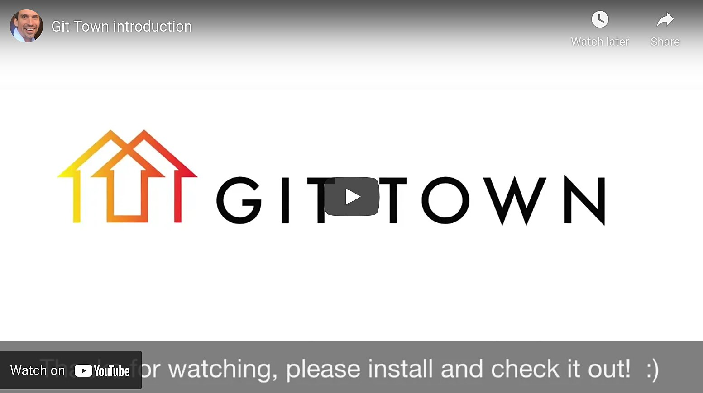

# High-level CLI for Git

Git Town provides additional Git commands that make creating, synchronizing,
shipping, and cleanup of Git branches more efficient. Supports mono-repos and
stacked changes.

 

  

 

Git is a very flexible source code management system. The Git CLI (rightfully)
supports all possible ways of using Git equally well. Git commands are generic
building blocks for implementing your specific Git workflow. This generic design
can make using the vanilla Git CLI repetitive in real life. As the screencast
above demonstrates, typical development activities like creating, synchronizing,
or shipping a feature branch can require running dozens of Git commands.

Git Town adds higher-level Git commands that perform typical steps in the
lifecycle of Git branches as a single step. Git Town's commands are compatible
with most common branching models like
[GitHub Flow](https://docs.github.com/en/get-started/quickstart/github-flow),
[Git Flow](https://www.atlassian.com/git/tutorials/comparing-workflows/gitflow-workflow),
[GitLab Flow](https://docs.gitlab.com/ee/topics/gitlab_flow.html),
[trunk-based development](https://trunkbaseddevelopment.com) and even committing
straight into the main branch. See also this
[external review](https://www.softpedia.com/get/Programming/Other-Programming-Files/Git-Town.shtml).

## What our users say

<blockquote class="twitter-tweet">
  

    <a href="https://twitter.com/hashtag/Gittown">#Gittown</a> you sexy beast!
    <a href="https://twitter.com/GitTown">@GitTown</a>
  

  &mdash; Elegant Development (<a href="https://twitter.com/elegant_dev/status/935643502754615297">@elegant_dev</a>)
</blockquote>

<blockquote class="twitter-tweet">
  

    Amazing <a href="https://twitter.com/GitTown">@GitTown</a> rocks! 🚀
    <a href="https://t.co/S5ouIBx2fe">https://t.co/S5ouIBx2fe</a>
  

  &mdash; Jose Quintana (<a href="https://twitter.com/joseluis_q/status/958632011777957888">@joseluis_q</a>)
</blockquote>

<blockquote class="twitter-tweet">
  

    All doable w/ just git, but git-town is a simpler mental-model and way less keystrokes
  

  &mdash; Ryan Nystrom (<a href="https://twitter.com/_ryannystrom/status/1155840573653356544">@_ryannystrom</a>)
</blockquote>

<blockquote class="twitter-tweet">
  

    I&#39;ve been using git-town along git-flow for a little while and it&#39;s been really nice
    <a href="https://t.co/E5nwHuXP1C">https://t.co/E5nwHuXP1C</a>
  
&mdash;
  dan reeves 🏳️‍🌈 (<a href="https://twitter.com/dnrvs/status/885081044847915010">@dnrvs</a>)
</blockquote>

<blockquote class="twitter-tweet">
  

  Wow <a href="https://twitter.com/GitTown">@GitTown</a> looks great, type less git commands for common branch/pr workflows.
  Similar to <a href="https://twitter.com/github">@github</a>’s “hub” but looks more powerful, and it logs the fit commands it runs under the hood.
  <a href="https://t.co/PxGs76TS5I">pic.twitter.com/PxGs76TS5I</a>

  &mdash; Gregor (<a href="https://twitter.com/gr2m/status/983913843351957504">@gr2m</a>)
</blockquote>

<blockquote>
  Supercharge your workflow with Git by relying on this surprisingly powerful
  and quite useful plugin that provides you with a series of extra Git commands.
    
  <b>
    <a href="https://www.softpedia.com/get/Programming/Other-Programming-Files/Git-Town.shtml">
      Softpedia article about Git Town
    </a>
  </b>
</blockquote>

