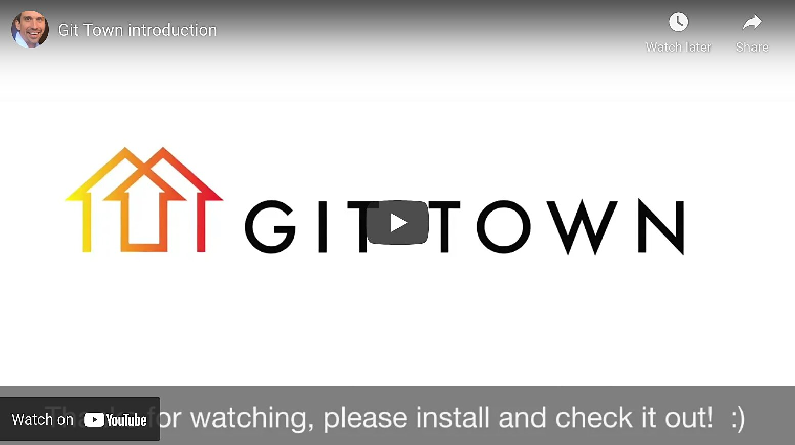

  

Git Town is a high-level command-line interface for Git. It adds Git commands
that make writing software in a team more efficient. This screencast shows it in
action:

 

  

 

Git is an amazing source code management system. It's CLI is (rightfully)
generic and basic. This allows it to support all the different ways of using Git
equally well. This can, however, make using the vanilla Git CLI cumbersome and
repetitive in real life. As the screencast above shows, merging a feature branch
into the main development branch can require up to 15 individual Git commands.

Git Town adds a layer of high-level commands to Git. They perform typical
development workflow operations like creating, synchronizing, or shipping
feature branches. Git Town helps you use Git similar to how an expert user
would, all while remaining as generic and unopinionated as Git itself is. Git
Town is compatible with most common branching models.
